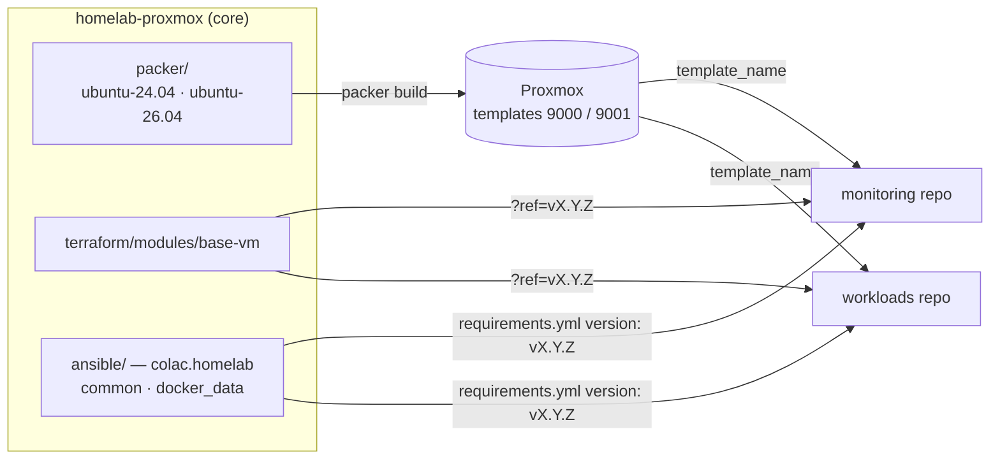

# Homelab Proxmox — Core

Infrastructure-as-code for a single-node **Proxmox VE** homelab, built as a
**Packer → Terraform → Ansible** pipeline and split into three repos by layer.
This is the **core** layer: the pieces every VM is built from.

Heavily "inspired" by
<https://github.com/bcochofel/homelab-proxmox-core/tree/main>.

| Repo | Layer | Owns |
|---|---|---|
| **homelab-proxmox** (this) | **core** | Packer templates, the `base-vm` Terraform module, the `colac.homelab` Ansible collection, homelab-wide architecture, TrueNAS notes |
| [homelab-proxmox-monitoring](https://github.com/colac/homelab-proxmox-monitoring) | **monitoring** | The monitoring VM: the Elastic Stack, exporters, Elastic Agent enrollment on every host |
| [homelab-proxmox-workloads](https://github.com/colac/homelab-proxmox-workloads) | **workloads** | The apps, one folder each: Nextcloud, k3s |

- **How it all fits together?** [docs/ARCHITECTURE.md](docs/ARCHITECTURE.md) —
  the layers, the contracts between them, runtime and secrets diagrams.
- **Building a template?** [packer/README.md](packer/README.md).
- **Changing the VM module?** [terraform/README.md](terraform/README.md).
- **Changing a shared role?** [ansible/README.md](ansible/README.md).
- **What is done and what is not?** [TODO.md](TODO.md).

## What core publishes



| Artifact | Consumed as | Doc |
|---|---|---|
| Proxmox templates `ubuntu-24.04-template` (9000), `ubuntu-26.04-template` (9001) | `template_name` in each Terraform project | [packer/README.md](packer/README.md) |
| `base-vm` module | `git::https://github.com/colac/homelab-proxmox.git//terraform/modules/base-vm?ref=vX.Y.Z` | [terraform/README.md](terraform/README.md) |
| `colac.homelab` collection (`common`, `docker_data`) | `requirements.yml` git source at a tag | [ansible/README.md](ansible/README.md) |

Consumers pin a **release tag**, never a branch, so a change here reaches a
VM only when its repo bumps the pin — one consumer at a time, reversible by
moving the pin back. semantic-release cuts the tags from Conventional Commits.

Core runs no Terraform and has no inventory: it never touches a running VM.

## Repository map

| Path | What it is | Doc |
|---|---|---|
| `packer/ubuntu-24.04/` | Base template build (`proxmox-iso`), VM ID 9000 — what Nextcloud is cloned from | [packer/README.md](packer/README.md) |
| `packer/ubuntu-26.04/` | The same on 26.04 LTS with LVM, VM ID 9001 — what monitoring and k3s clone | [packer/README.md](packer/README.md) |
| `terraform/modules/base-vm/` | The one VM module | [terraform/README.md](terraform/README.md) |
| `ansible/` | The `colac.homelab` collection | [ansible/README.md](ansible/README.md) |
| `docs/ARCHITECTURE.md` | Homelab-wide architecture and contracts | — |
| `scripts/` | Standalone ops helpers (disk vetting); not pipeline | [scripts/README.md](scripts/README.md) |
| `TrueNAS/` | NAS install + post-install hardening notes | [TrueNAS/README.md](TrueNAS/README.md) |
| `RUNBOOK-2604.md` | Temporary: the 26.04 template + split-disk rollout, across all three repos | — |
| `TODO.md` | Status for core and homelab-wide items | — |
| `mise.toml` | Pinned tools and every entry point; `mise tasks` lists them | [see below](#toolchain) |
| `secrets.yaml` / `.example` | Template-build credentials, SOPS-encrypted — committed as ciphertext | [see below](#secrets) |

## Toolchain

[mise](https://mise.jdx.dev) pins every tool and provides every entry point.
There is no Makefile and no direnv.

```bash
mise trust && mise install      # once per clone: Packer, Terraform, sops, age, Python, Node, …
mise run setup                  # venv deps, Node tools, git hooks, tflint plugins
mise tasks                      # everything you can run
```

```bash
mise run lint                   # pre-commit on every file + ansible-lint (production profile)
mise run tf:validate            # the module: fmt + validate, no credentials
mise run packer:validate 26.04  # init + validate with real variables
mise run packer:build 26.04     # build on Proxmox; extra args go to packer build
mise run release:dry-run        # the version semantic-release would cut
```

Pins are load-bearing and shared with the other two repos: Terraform `1.15.7`,
Telmate/proxmox provider `3.0.2-rc07`, ansible-core `2.17.14`. Bump them here
first, deliberately.

Per-machine settings go in `mise.local.toml` (git-ignored) — for example the
LAN NIC Packer should advertise when a VPN holds the default route:

```toml
[env]
PACKER_HTTP_INTERFACE = "enp3s0"
```

## Secrets

**One encrypted file, decrypted per command, never into your shell.** The
credentials building a template needs — the Proxmox endpoint, the
`packer@pve` token, the console password hash — live in `secrets.yaml`,
SOPS-encrypted with age. SOPS encrypts *values in place*, so the file is
ciphertext and **is committed**; `.gitleaks.toml` allowlists it and
`.gitignore` deliberately does not list it.

`.mise/sops-exec` is the only thing that decrypts it. `mise run packer:*`
calls it with the `packer` profile, which exports exactly what Packer reads —
`PKR_VAR_proxmox_api_url` (endpoint + `/api2/json`), the token, the password
hash, the node and TLS flag from `mise.toml`, and `ssh_authorized_keys` from
`~/.ssh/homelab-proxmox.pub` — for that one command. A bare `packer build`
gets none of them, and neither does any other process: not your shell, not an
AI agent working in the repo.

```bash
age-keygen -o ~/.config/sops/age/keys.txt   # first time only; add the public
chmod 600 ~/.config/sops/age/keys.txt       # key to .sops.yaml as a recipient
mise run secrets:edit                       # decrypt -> VS Code -> re-encrypt on save
mise run secrets:check                      # missing keys, by name; never values
```

The Terraform token and every app secret live in the repos that use them —
see [docs/ARCHITECTURE.md](docs/ARCHITECTURE.md#secrets-least-privilege-per-command)
for the whole map. What stays out of git entirely: the age **private** key,
`~/.ssh/homelab-proxmox` (the deploy key), any `*.pkrvars.hcl`, and
`mise.local.toml`.

## Proxmox API users

Packer and Terraform each authenticate with their own scoped Proxmox user and
token — template-build rights versus clone/configure rights, neither carrying
the other's. The `pveum` commands:

- Packer — [packer/README.md](packer/README.md#create-the-packer-user-in-proxmox)
- Terraform — [terraform/README.md](terraform/README.md#create-the-terraform-user-in-proxmox)
  (the token is stored in the monitoring and workloads repos, not here)

## Conventions

- **Conventional Commits**, enforced by commitlint. Versioning, tags and
  `CHANGELOG.md` are automated by semantic-release — never hand-edit either.
  A change consumers must adapt to carries a `BREAKING CHANGE:` footer.
- **pre-commit** on every commit: `terraform_docs`, `terraform_fmt`,
  `packer_fmt`, `packer_validate` (syntax only — real variables exist only
  inside `mise run packer:*`), `markdownlint`, `shellcheck`, commitlint.
- **Terraform docs are generated.** The block between `BEGIN_TF_DOCS` and
  `END_TF_DOCS` is written by `terraform-docs`; edit the `.tf` descriptions.
- **Ansible role variables are prefixed with the role name**; ansible-lint's
  production profile enforces it and must stay green.
- **Markdown**: heading levels increment by one (MD001), fenced blocks declare
  a language (MD040). MD013/MD033/MD060 are disabled.
