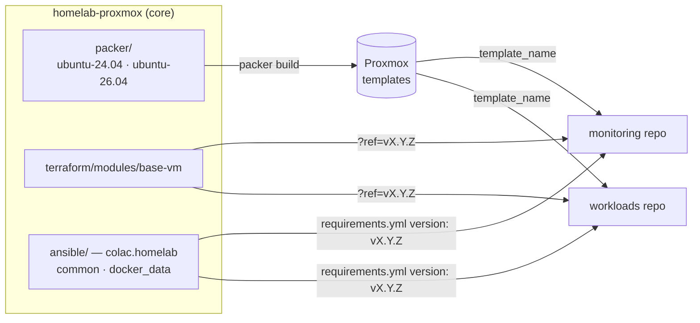

# Homelab Proxmox — Core

Infrastructure-as-code for a single-node **Proxmox VE** homelab, built as a
**Packer → Terraform → Ansible** pipeline and split into three repos by layer.
This is the **core** layer: the pieces every VM is built from, and the
homelab-wide docs.

Heavily "inspired" by
<https://github.com/bcochofel/homelab-proxmox-core/tree/main>.

| Repo | Layer | Owns |
|---|---|---|
| **homelab-proxmox** (this) | **core** | Packer templates, the `base-vm` Terraform module, the `colac.homelab` Ansible collection, homelab-wide docs |
| [homelab-proxmox-monitoring](https://github.com/colac/homelab-proxmox-monitoring) | **monitoring** | The monitoring VM: Elastic Stack, exporters, Elastic Agent enrollment on every host |
| [homelab-proxmox-workloads](https://github.com/colac/homelab-proxmox-workloads) | **workloads** | The apps, one folder each: Nextcloud, k3s |

## Start here

| I want to… | Read |
|---|---|
| understand how it all fits together | [docs/ARCHITECTURE.md](docs/ARCHITECTURE.md) |
| set up my machine and work in any of the repos | [docs/DEVELOPMENT.md](docs/DEVELOPMENT.md) |
| issue, store or rotate a credential | [docs/CREDENTIALS.md](docs/CREDENTIALS.md) |
| build a VM template | [packer/README.md](packer/README.md) |
| change the VM module | [terraform/README.md](terraform/README.md) |
| change a shared Ansible role | [ansible/README.md](ansible/README.md) |
| know what is done and what is not | [TODO.md](TODO.md) |

AI agents: [AGENTS.md](AGENTS.md) (imported by `CLAUDE.md`).

## What core publishes



| Artifact | Consumed as |
|---|---|
| Proxmox templates `ubuntu-24.04-template` (Nextcloud), `ubuntu-26.04-template` (monitoring, k3s) | `template_name` in each Terraform project |
| `base-vm` module | `git::https://github.com/colac/homelab-proxmox.git//terraform/modules/base-vm?ref=vX.Y.Z` |
| `colac.homelab` collection (`common`, `docker_data`) | a git source at the same tag in `ansible/requirements.yml` |

Consumers pin a **release tag**, never a branch, so a change here reaches a VM
only when its repo bumps the pin — one consumer at a time, reversible by moving
the pin back. See [docs/DEVELOPMENT.md](docs/DEVELOPMENT.md#releasing-a-core-change).

## Quick start

```bash
mise trust && mise install && mise run setup   # tools, venv, hooks
mise run secrets:check                         # keys present? see docs/CREDENTIALS.md
mise run lint                                  # everything pre-commit and ansible-lint check
mise run packer:build 26.04                    # build a template (credentials, Proxmox)
```

## Repository map

| Path | What it is |
|---|---|
| `packer/ubuntu-24.04/`, `packer/ubuntu-26.04/` | Template builds (`proxmox-iso`) |
| `terraform/modules/base-vm/` | The one VM module |
| `ansible/` | The `colac.homelab` collection (`galaxy.yml` at its root) |
| `docs/` | Homelab-wide: architecture, credentials, development |
| `scripts/` | Standalone ops helpers (disk vetting); not pipeline |
| `TrueNAS/` | NAS install and hardening notes — not automated |
| `.mise/sops-exec`, `mise.toml` | Per-command secrets and every entry point |
| `secrets.yaml` (+ `.example`) | Template-build credentials, SOPS-encrypted, committed as ciphertext |
