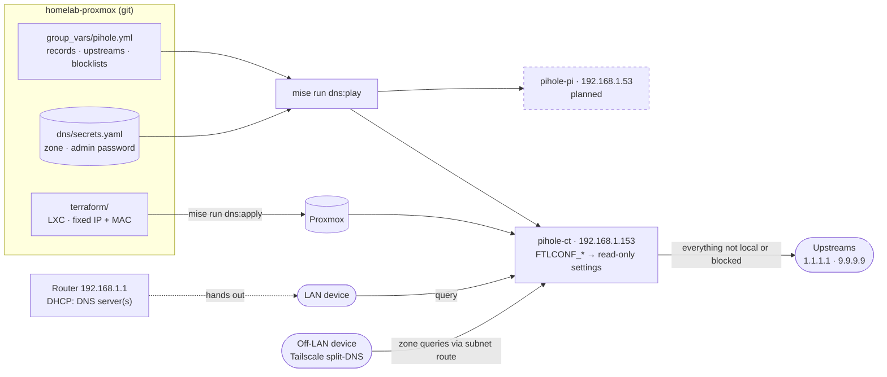

# DNS — two Pi-holes, one configuration

The homelab's LAN resolvers: Pi-hole v6 on **two hosts with identical
configuration**, so either can answer every query.

| Resolver | Address | Role | Created by | Configured by | Status |
|---|---|---|---|---|---|
| LXC container `pihole-ct` (ID 103) | **192.168.1.153** | failover | Terraform (`terraform/`) | Ansible (`ansible/`) | **live** since 2026-10-07 — today the only resolver |
| Raspberry Pi `pihole-pi` | **192.168.1.53** | primary — physical, survives a Proxmox outage | Raspberry Pi Imager | Ansible (`ansible/`) | planned (core's TODO) |

The hand-built Pi-hole that used to hold `.53` is stopped, kept for a week as
the rollback, then deleted.

Both hosts are in the Ansible group `pihole`, so one playbook run gives them
the same records, upstreams, blocklists and password. Nothing is configured by
hand: the web UI shows every managed setting as read-only.

It is a **platform service**: every name the other repos rely on resolves
here, including `pve.<zone>`, which Packer and Terraform use to reach the
Proxmox API. That is why it lives in core rather than in workloads.

| | |
|---|---|
| Config | `ansible/inventory/group_vars/pihole.yml` — records, upstreams, blocklists |
| Secrets | `dns/secrets.yaml`: `dns_zone`, `pihole_web_password` |
| Container | Debian 13 LXC, unprivileged, 1 core, 512 MB, 4G, fixed MAC; starts first on boot. State: Terraform Cloud workspace `DNS` |
| Raspberry Pi | Raspberry Pi OS Lite 64-bit — Debian 13, the same base as the container |
| Admin UI | `http://192.168.1.153/admin` (and `http://192.168.1.53/admin` once the Pi exists) |



## How it is put together

- **One role, any Debian host.** The `pihole` role assumes nothing about where
  it runs: an unprivileged container (Ansible connects as `root`) or a
  Raspberry Pi (a normal user with `sudo`) — the difference is two inventory
  variables, not code.
- **LXC, not a VM, and not Docker**, for the Proxmox side. One service needs a
  few hundred MB, so a VM is overkill; Docker inside LXC is something Proxmox
  advises against. Pi-hole is installed natively on both hosts.
- **Configuration is `FTLCONF_*` environment variables**, rendered by Ansible
  into `/etc/pihole/ftlconf.env` and loaded by a systemd drop-in for
  `pihole-FTL`. Settings set that way are read-only in the UI — the mechanism
  Pi-hole's own Docker image recommends. Ansible never edits `pihole.toml`,
  which Pi-hole rewrites itself; it only seeds it once so the installer runs
  unattended.
- **Blocklists live in Pi-hole's gravity database**, not its config, so the
  role inserts the managed ones there (`INSERT OR IGNORE`) and refreshes
  gravity when one is added. Lists added by hand are left alone.
- **Versions:** the installer script is pinned (`pihole_installer_ref`), but it
  always installs the **latest stable** Pi-hole — it offers no exact pin, and
  Pi-hole supports only its latest release. The playbook prints each host's
  versions. Upgrades are deliberate, never a side effect: run the playbook with
  `-e pihole_upgrade=true`.

## The router

**Today:** DNS Server 1 = `192.168.1.153`. **Once the Pi exists:** Server 1 =
`192.168.1.53`, Server 2 = `192.168.1.153`. Three rules make that work:

1. **Never a public resolver as server 2.** Many clients query both servers
   rather than one then the other, so a public one leaks ads past Pi-hole and
   makes the private names fail at random. Until the Pi exists, leave server 2
   empty (or `.153` again) — DNS then goes down with Proxmox, which the Pi is
   for. Two Pi-holes with identical config are safe to mix; that is why the
   configuration is shared.
2. **DHCP reservations for both addresses.** The pool (`.2`–`.254`) contains
   `.53` and `.153`, and nothing stops the router leasing them to another
   device. Reserve `.153` for the container's MAC (`BC:24:11:00:01:53`,
   pinned in `terraform/variables.tf` so a rebuild keeps it) and `.53` for the
   Pi's MAC (`ip link` on the Pi).
3. **IPv6 is active on the LAN.** Check what the router advertises as the IPv6
   DNS server: if it is the router or the ISP, clients that prefer IPv6 skip
   Pi-hole entirely. Point it at nothing (so clients fall back to the IPv4
   servers) or turn IPv6 DNS advertisement off.

**Tailscale split-DNS** (admin console → DNS → the nameserver restricted to
your zone) must name `192.168.1.153` — while it names the stopped `.53`,
off-LAN devices cannot resolve `nextcloud.<zone>`. Add `.53` back next to it
once the Pi exists.

## Verify it

From the laptop, on the LAN with its normal DNS:

```bash
mise run dns:play playbooks/99-healthcheck.yml   # every record, a public name, blocking — on each host
dig @192.168.1.153 pve.<zone> +short             # 192.168.1.169 — answered by the container directly
dig pve.<zone> +short                            # the same, via whatever DHCP handed out
resolvectl status | grep -A2 'DNS Servers'       # shows 192.168.1.153 once the lease renews
dig doubleclick.net +short                       # 0.0.0.0 — blocked
dig github.com +short                            # real addresses — upstreams work
```

Then the things the records exist for: `https://nextcloud.<zone>` and
`https://kibana.<zone>` open without a certificate warning, and
`mise run dns:plan` reaches the Proxmox API by name. Off the LAN, on Tailscale:
`dig nextcloud.<zone> +short` returns `192.168.1.43`. In the admin UI, the
query log shows the laptop's queries arriving, and Settings → DNS shows the
managed values greyed out (read-only).

A device still asking `.53` holds an old lease: renew it (reconnect, or
`sudo networkctl renew <interface>`), or wait out the one-day lease.

## Deploy the container (failover, `.153`) — done 2026-10-07

Kept as the procedure for a rebuild on a fresh node. It needs no other
resolver to be down: the container comes up beside whatever already answers.

1. **The container template on Proxmox.** Neither Terraform's provider nor
   Packer can fetch LXC templates, so this is a one-time step on the node:

   ```bash
   pveam update
   pveam available --section system | grep debian-13
   pveam download local debian-13-standard_13.6-1_amd64.tar.zst   # the name it listed
   ```

   If the listed name differs from the default `ostemplate` in
   `terraform/variables.tf`, change the default there (it is part of the code,
   and changing it later re-creates the container).
2. **Terraform Cloud workspace `DNS`** in `colac_homelab`, Execution Mode
   **Local**.
3. **Credentials** — core's Terraform token in `secrets.yaml`, and
   `dns/secrets.yaml` (`mise run secrets:edit dns`). Issuing them:
   [docs/CREDENTIALS.md](../docs/CREDENTIALS.md#pi-hole-admin-password).
   `mise run secrets:check` must pass for all three profiles.
4. Build, configure and check it:

   ```bash
   mise run dns:plan                        # expect: 1 container + the inventory file
   mise run dns:apply
   mise run dns:play playbooks/site.yml     # install, configure, health check
   dig @192.168.1.153 pve.<zone> +short     # from the laptop: 192.168.1.169
   ```

5. Router: reservation for `.153`, then **DNS Server 2 → `192.168.1.153`**.

## Add the Raspberry Pi (primary, `.53`) — later

Not deployed yet; until then the hand-built Pi-hole keeps `.53`. The plan in
core's TODO replaces step 1 with cloud-init files kept in this folder and a
`mise run dns:pi-image` task, so re-imaging never depends on clicking through
Imager — and gives the Pi a static `.53` without a router reservation. The
manual path, meanwhile:

1. **Flash it with Raspberry Pi Imager:** Raspberry Pi OS (other) →
   **Raspberry Pi OS Lite (64-bit)**. In OS customisation:
   - hostname `pihole-pi`, a username of your choice and a password (keep it
     in your password manager — it is the console fallback);
   - Services → **Enable SSH → Allow public-key authentication only**, and
     paste the deploy key's public half: `cat ~/.ssh/homelab-proxmox.pub`;
   - no Wi-Fi — a resolver belongs on Ethernet.
2. **Boot it on Ethernet** and find the address it got from DHCP (the router's
   client list). Note its MAC: `ssh <user>@<that-ip> ip link`.
3. **Inventory:** `cp ansible/inventory/hosts.yml.example ansible/inventory/hosts.yml`
   (git-ignored), set `ansible_user` to your username and `ansible_host` to the
   **temporary** address.
4. **Configure it while the old Pi-hole still holds `.53`:**

   ```bash
   mise run dns:inventory                   # pihole-ct and pihole-pi under pihole
   mise run dns:play playbooks/site.yml --limit pihole-pi
   ```

5. **Hand it `.53`** — the container answers as server 2 the whole time, so
   there is no outage:
   - stop the hand-built Pi-hole on the node (`pct stop <old-id>`; keep it a
     week for rollback, then delete it);
   - on the router, reserve `.53` for the Pi's MAC; reboot the Pi;
   - set `ansible_host: 192.168.1.53` in `hosts.yml`, then
     `mise run dns:play playbooks/99-healthcheck.yml`.

## Operating it

Every command runs against **both** resolvers unless you add `--limit`.

| Task | How |
|---|---|
| Add or change a record | Edit `pihole_local_records` in `ansible/inventory/group_vars/pihole.yml`, then `mise run dns:play playbooks/10-pihole.yml --check --diff` and without `--check` |
| Add a blocklist | Append to `pihole_adlists`, re-run the playbook |
| Upgrade Pi-hole | One at a time, so one always answers: `mise run dns:play playbooks/10-pihole.yml -e pihole_upgrade=true --limit pihole-ct`, health check, then `--limit pihole-pi` |
| Rebuild the container | `mise run dns:tf apply -replace=proxmox_lxc.pihole`, then `mise run dns:play playbooks/site.yml --limit pihole-ct` — the Pi answers meanwhile |
| Rebuild the Pi | Re-flash as above, then the playbook with `--limit pihole-pi` — the container answers meanwhile |
| Change the admin password | `mise run secrets:edit dns`, re-run the playbook |
| Check them | `mise run dns:play playbooks/99-healthcheck.yml` — every record, a public name, and blocking, on each host |
| Any other Pi-hole setting | `pihole_ftlconf_extra` in group_vars (`{ misc_privacylevel: 0 }`), re-run |

Other repos' services get their name by a PR to `pihole_local_records` — that
list is the DNS contract in [docs/ARCHITECTURE.md](../docs/ARCHITECTURE.md).

**Break-glass** — if both resolvers are down, your laptop cannot resolve
`pve.<zone>` or `app.terraform.io`, so Terraform cannot fix it. Give the laptop
a public resolver and the Proxmox name for the duration:

```bash
sudo resolvectl dns <interface> 1.1.1.1                      # undo: sudo resolvectl revert <interface>
echo "192.168.1.169 pve.<zone>" | sudo tee -a /etc/hosts     # remove afterwards
```

## Not yet

- **Monitoring** — neither resolver is an agent target of the monitoring repo
  yet.
- `home-nas.local` uses `.local`, which belongs to mDNS; some clients will not
  ask Pi-hole for it. A name in the private zone (`nas.<zone>`) would be more
  reliable — kept as-is for now, carried over from the hand-built Pi-hole.
