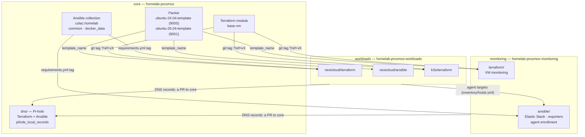
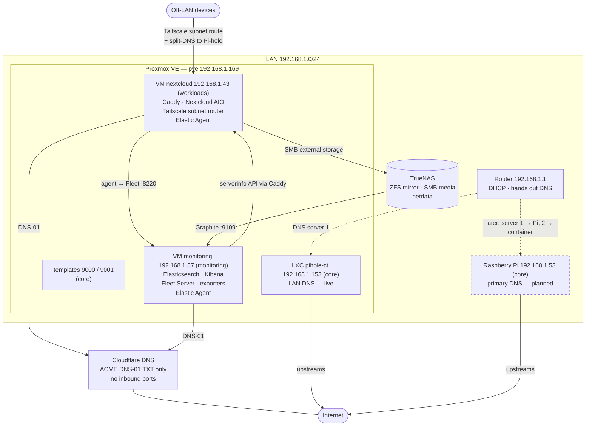
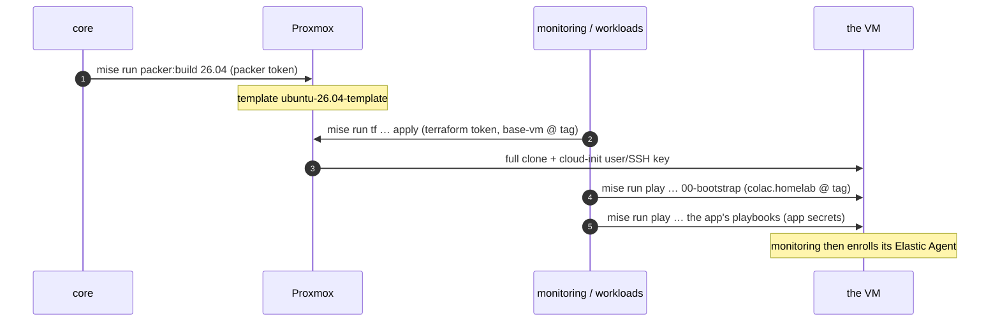
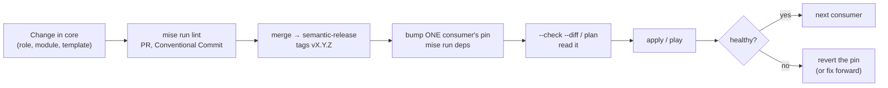
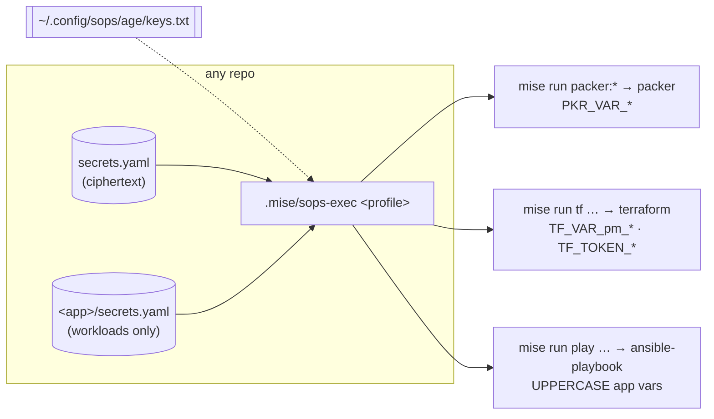

# Homelab architecture

How the homelab is split into three repos, what each one publishes and
consumes, and how a change moves through them. Each repo's own README covers
its internals; this is the page that ties them together.

## The three layers

| Layer | Repo | Owns | Changes |
|---|---|---|---|
| **core** | [homelab-proxmox](https://github.com/colac/homelab-proxmox) (this) | Packer templates, the `base-vm` Terraform module, the `colac.homelab` Ansible collection (`common`, `docker_data`), **DNS** (Pi-hole, `dns/`), homelab-wide docs, TrueNAS notes | Rarely; everything else depends on it |
| **monitoring** | [homelab-proxmox-monitoring](https://github.com/colac/homelab-proxmox-monitoring) | The monitoring VM: single-node Elasticsearch, Kibana, Fleet Server, exporters — and Elastic Agent enrollment on **every** host | Medium |
| **workloads** | [homelab-proxmox-workloads](https://github.com/colac/homelab-proxmox-workloads) | The apps, one folder each: Nextcloud (live), k3s (VM only) | Often |

The split follows blast radius and ownership, not technology:

- **A change can only break its own layer.** A Caddy bump cannot touch
  Elasticsearch, and an Elasticsearch upgrade cannot touch Nextcloud — they
  are different repos, workspaces, secrets and release tags.
- **Each layer holds only the credentials it uses.** Core cannot clone a VM;
  workloads cannot read the Elastic passwords; monitoring cannot read the
  Nextcloud users. Inside each repo, Terraform and Ansible get different
  subsets again (see [Secrets](#secrets-least-privilege-per-command)).
- **Each layer is a small, self-contained context.** A person — or an AI
  agent — working on Nextcloud loads one `AGENTS.md`, one runbook and one
  secrets file, not the history of the Elastic port.
- **Observability is separate from what it observes.** The thing you use to
  see a failure should not share a release, or a failure mode, with it.

## Contracts between the layers

Everything that crosses a repo boundary is explicit, versioned, and written
down here. Nothing else may.

| Contract | Producer → consumer | Form | Changing it safely |
|---|---|---|---|
| VM templates | core → all VMs | Proxmox template **name** (`template_name`) | Build the new one alongside (new `vm_id`), move consumers one at a time, delete the old one last |
| ES OS prerequisites | core → monitoring | Baked into the template: `vm.max_map_count ≥ 262144`, memlock/nofile, `/opt/elastic` | Monitoring's `elastic_preflight` fails loudly if a template lacks them |
| Elastic Agent package | core → every VM | Pre-installed by Packer, disabled; version tracks monitoring's `stack_version` | Drift is tolerated: `elastic_agent` reinstalls the right version |
| `base-vm` module | core → every Terraform project | `git::https://github.com/colac/homelab-proxmox.git//terraform/modules/base-vm?ref=vX.Y.Z` | Release a tag; bump one project's `ref`, `init -upgrade`, read the plan |
| `colac.homelab` collection | core → every Ansible tree | `requirements.yml`: `…homelab-proxmox.git#/ansible/`, `version: vX.Y.Z` | Release a tag; bump one consumer; `00-bootstrap.yml --check --diff` |
| Agent targets | workloads → monitoring | Host + address in monitoring's `ansible/inventory/hosts.yml` (group `agents`) | Add/remove the entry; run `20` and `50` with `--limit` |
| Nextcloud metrics | workloads → monitoring | `nextcloud_serverinfo_token`, minted on the VM, stored in monitoring's `secrets.yaml` | Re-mint, update monitoring's secret, re-run `45-exporters.yml` |
| Private DNS names | each layer → core | A records (`nextcloud.<zone>`, `kibana.<zone>`, `pve.<zone>`) in `pihole_local_records`, `dns/ansible/inventory/group_vars/pihole.yml` | A PR to core, then `mise run dns:play playbooks/10-pihole.yml` |
| Toolchain pins | core → all | Same versions in every `mise.toml` (Terraform 1.15.7, ansible-core 2.17.14, …) | Bump in core first, then the others |

## Runtime view

What actually runs, and the supporting infrastructure none of the repos
provision.

The k3s VM is not deployed (workloads keeps its Terraform recipe), and the
Raspberry Pi is planned — dashed above.

- **Nothing is exposed to the internet.** Cloudflare only answers ACME DNS-01
  challenges, so services get real Let's Encrypt certificates for names that
  resolve only through Pi-hole.
- **Off-LAN reach is Tailscale:** the Nextcloud VM advertises the LAN as a
  subnet route, and split-DNS sends the zone's lookups to Pi-hole
  (`192.168.1.153`).
- **Data lives on TrueNAS**, mounted by apps over SMB, never on a VM disk.
  VM disks hold only rebuildable state and named Docker volumes on a separate
  data disk.

## How a VM comes to exist

The same three stages for every VM, spread over two repos.

| Stage | Owns | Re-run when |
|---|---|---|
| **Packer** (core) | The golden image: OS, hardening, Docker, Tailscale, the Elastic Agent package, the Elasticsearch OS prerequisites | The base OS or baked-in tooling changes (rare) |
| **Terraform** (monitoring, workloads) | VM existence and shape: CPU/RAM/disks, network, cloud-init user | A VM is resized, added or destroyed |
| **Ansible** (monitoring, workloads) | Everything running inside the VM | Any app/config change (often — it is idempotent) |

Cloud-init is used **only** to create the login user and inject the SSH key.
App configuration through Proxmox's cloud-init hung or timed out on first
boot, runs once, and fails silently; Ansible re-runs in seconds and fails
loudly.

## Rolling out a change to a shared piece

One consumer at a time, each step reversible by moving a pin back. The
exception is Elasticsearch data, which upgrades in place and cannot be
downgraded — that is a monitoring-repo concern, documented in its runbook.

## Secrets: least privilege per command

Every repo uses the same scheme: SOPS + age files committed as ciphertext,
decrypted by `.mise/sops-exec` for **one command**, which exports only what
that command's tool reads. Nothing is ever exported into the shell — so
neither a human's terminal nor an AI agent working in the repo holds a
credential between commands.

Which file and profile each repo uses, what each profile exports, and how
every credential is issued and rotated: [CREDENTIALS.md](CREDENTIALS.md).
Next steps toward least privilege — one Terraform token per repo, a
read-only identity for AI agents — are in each repo's TODO.

## Tooling

The same in every repo — mise for tools and entry points, Conventional
Commits and semantic-release for versions, one `AGENTS.md` per repo (plus one
per app in workloads) for AI agents. See [DEVELOPMENT.md](DEVELOPMENT.md).

## DNS

Pi-hole is the LAN's only resolver and holds the private A records every
service depends on — including `pve.<zone>`, which Packer and Terraform need
to reach the Proxmox API with TLS verification on. It is a **platform
service in core** (`dns/`), designed as two hosts with one configuration:

| Resolver | Address | Role | Status |
|---|---|---|---|
| LXC container `pihole-ct` | `192.168.1.153` | failover; created by Terraform | **live** since 2026-10-07 — today the only resolver |
| Raspberry Pi `pihole-pi` | `192.168.1.53` | primary; physical, so DNS survives a Proxmox outage | planned |

The same Ansible role configures both through Pi-hole's own `FTLCONF_*`
settings, which the web UI shows as read-only, so either can answer any query.
The record list is code, and another repo's service gets its name by a PR to
it. Runbook, including a diagram of how a query and a config change flow:
[dns/README.md](../dns/README.md).

Until the Pi exists, DNS shares the hypervisor's fate: if Proxmox is down, so is
name resolution — and with it `pve.<zone>`, the name Terraform needs to fix
anything. The runbook's break-glass section covers that. Still ahead (core's
TODO): the Pi, and monitoring both resolvers from the monitoring repo. CoreDNS as an authoritative zone with transfers to a
secondary is the step after that — worth it once k3s wants wildcard records
or the record list grows, not before.
